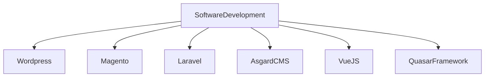

## Hello world 👋
My name is William Verde, I'm Computer Science Engineer from [Universidad Nacional Experimental del Táchira](http://www.unet.edu.ve/) - Venezuela :earth_americas: 

### Work Experience :briefcase:
I have worked as an Analyst and Full Stack Web Developer since 2011 in differents projects and companies.

### Currently working on :computer:

### About me :arrow_down:
- Linkedin - [William Verde](https://www.linkedin.com/in/ingwilliamverde)
- Website - [William Verde](https://williamverde.com/)

<!--
**willvrd/willvrd** is a ✨ _special_ ✨ repository because its `README.md` (this file) appears on your GitHub profile.

Here are some ideas to get you started:

- 🔭 I’m currently working on ...
- 🌱 I’m currently learning ...
- 👯 I’m looking to collaborate on ...
- 🤔 I’m looking for help with ...
- 💬 Ask me about ...
- 📫 How to reach me: ...
- 😄 Pronouns: ...
- ⚡ Fun fact: ...
-->
